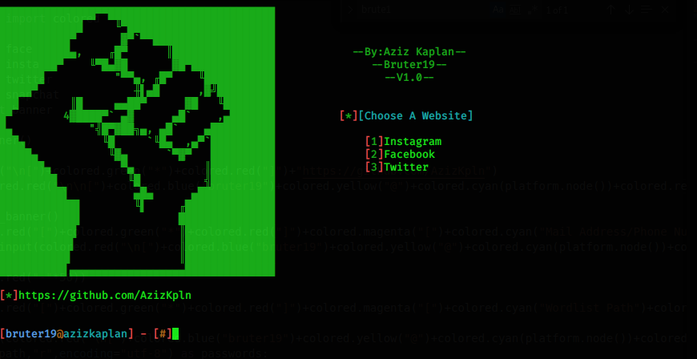
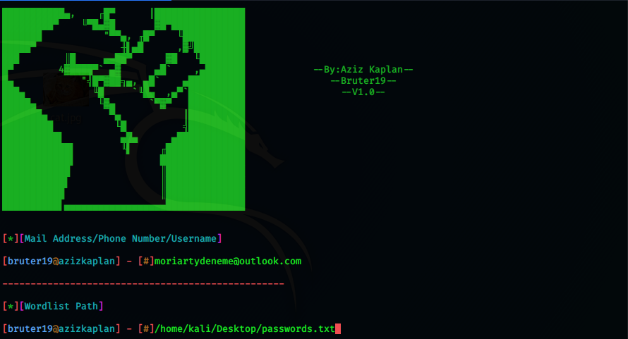

# Bruter19
* Advanced Brute Force Attack Tool.
* This tool has been developed for "ethical hacking course" students don't use it for illegal purposes.
# 
# INSTALLATION
* chmod +x setup.sh
* sudo ./setup.sh
* sudo python3 bruter19.py
# USAGE
# 
* Give The Mail 
* Give The Path Of The Wordlist
* Wait :D
